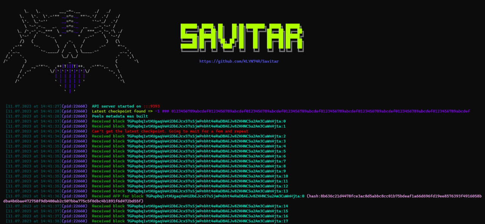
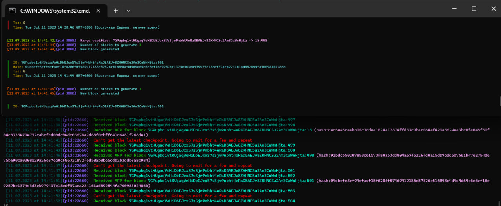

<div align="center">

<!-- [](https://git.io/typing-svg) -->
[](https://git.io/typing-svg)

# <b>A super useful tool to grab finalization proofs & get latest state as fast as possible</b>


</div>

## <b>Intro</b>

Savitar is used by <code>dev_tachyon</code> workflow to make a pro-active calls and get the <code>AGGREGATED_FINALIZATION_PROOFS</code> after getting <code>commitments</code> and <code>finalization proofs</code>. This tool will be mutable, configurable and with maximum orientation on paralelization.

## <b>Who can use it</b>

It's a must have tool for wallets, explorers, etc. to understand the status of block and state changes
## <b>How it works</b>

Savitar requires working KLY node to make queries to. Look at configs


```json

{
    "symbioteID":"aaaaaaaaaaaaaaaaaaaaaaaaaaaaaaaaaaaaaaaaaaaaaaaaaaaaaaaaaaaaaaaa",
    "node":"http://localhost:7331",

    "passive":false,
    "proactiveSettings":{},
    
    "serverConfigs":{
        "interface":"::",
        "port":9393
    },

    "stuffDealer":"http://localhost:7331",
    "checkpointTrackerTimeout":5000

}

```

You should define appropriate <code>symbioteID</code>(analogy for <code>chainId</code> in EVM-compatible chains) to work on appropriate symbiote(chain). Then, using <code>node</code> value, Savitar grabs the latest checkpoint and based on <code>poolsMetadata</code> starts to find blocks for approprate subchains and grab commitments and finalization proofs. Savitar has proactive mode, that's why it initiates a separate thread for each subchain to get the <code>AGGREGATED_FINALIZATION_PROOF</code>

<br/>


There are some screenshots of working environment with 3 subchains and 4 validators(3 prime pools + 1 reserve pool)


<br/><br/>

### Initialization:



<br/><br/>

### Working process(proofs grabbing):




## <b>API</b>

For wallets and explorers Savitar proposes simple API (coming soon)


## <b>Improvements</b>

Definitely it's initial solution and simplest proposed software for lightning fast finalization. In 2 files we insert apppropiate minimal logic. You can write your own realizations using Rust, C++ and so on. Moreover, soon it will be possible to build <b><i>KLY infrastructure</i></b> and using deep configs tree on workflows - create super-parallel solutions, scale and so on.